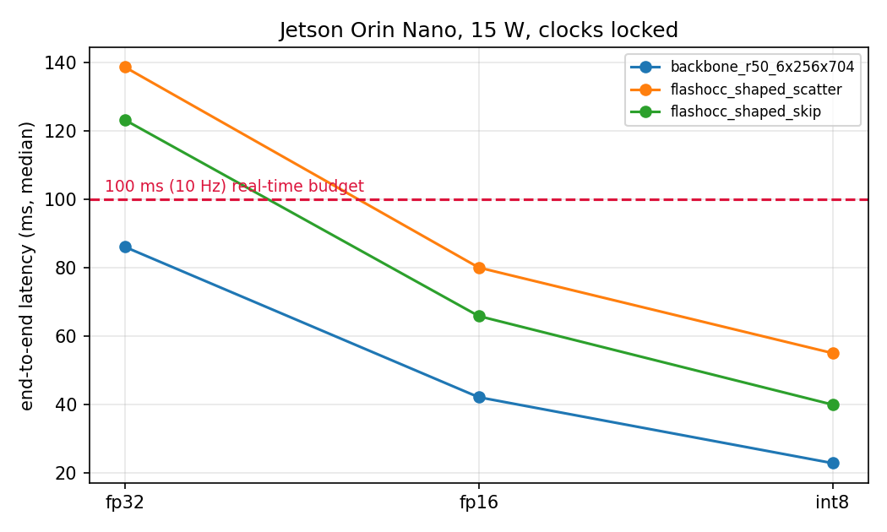

# Jetson evidence pack — 15W

Board: NVIDIA Jetson Orin Nano Developer Kit  |  NV Power Mode: 15W / 0  |  7485 MB RAM

**Weights are random — these are cost measurements, not accuracy.** Latency is set by architecture and tensor shapes, so it is representative; no accuracy claim is made or implied.

| model | precision | e2e ms | GPU ms | qps | power W | peak RAM MB | max °C | 10 Hz |
|---|---|---|---|---|---|---|---|---|
| backbone_r50_6x256x704 | fp32 | 85.97 | 84.04 | 11.84 | 9.5 | 3763 | 59.9 | PASS |
| backbone_r50_6x256x704 | fp16 | 42.01 | 39.85 | 24.97 | 9.4 | 3836 | 59.8 | PASS |
| backbone_r50_6x256x704 | int8 | 22.74 | 20.70 | 48.06 | 7.7 | 3884 | 58.5 | PASS |
| flashocc_shaped_scatter | fp32 | 138.54 | 133.10 | 7.48 | 11.9 | 3744 | 58.8 | **FAIL** |
| flashocc_shaped_scatter | fp16 | 79.92 | 74.24 | 13.40 | 7.9 | 3885 | 58.2 | PASS |
| flashocc_shaped_scatter | int8 | 54.91 | 49.32 | 20.18 | 7.7 | 3961 | 57.8 | PASS |
| flashocc_shaped_skip | fp32 | 123.09 | 119.47 | 8.33 | 12.1 | 3742 | 60.4 | **FAIL** |
| flashocc_shaped_skip | fp16 | 65.74 | 61.22 | 16.25 | 10.7 | 3676 | 60.4 | PASS |
| flashocc_shaped_skip | int8 | 39.85 | 35.45 | 28.07 | 8.4 | 3558 | 59.0 | PASS |

### Cost of the LSS view transform (scatter - skip)

| precision | with | without | cost ms | share of frame |
|---|---|---|---|---|
| fp32 | 138.54 | 123.09 | **15.45** | 11% |
| fp16 | 79.92 | 65.74 | **14.18** | 18% |
| int8 | 54.91 | 39.85 | **15.06** | 27% |

### Where the frame goes, and what compresses

| precision | backbone | BEV enc + head | view transform | total |
|---|---|---|---|---|
| fp32 | 85.97 (62%) | 37.12 (27%) | 15.45 (11%) | 138.54 |
| fp16 | 42.01 (53%) | 23.73 (30%) | 14.18 (18%) | 79.92 |
| int8 | 22.74 (41%) | 17.11 (31%) | 15.06 (27%) | 54.91 |

| stage | FP32 -> INT8 speedup |
|---|---|
| backbone | **3.78x** |
| BEV enc + head | **2.17x** |
| view transform | **1.03x** |

The view transform is a scatter into a 200x200 BEV grid -- memory-bound, not compute-bound -- so quantisation does almost nothing for it. As the compute-bound stages shrink, it becomes a hard floor on what compression can buy for this architecture.

